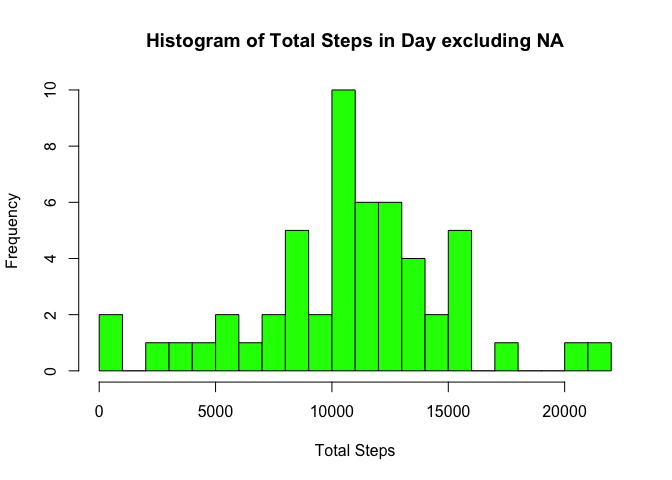
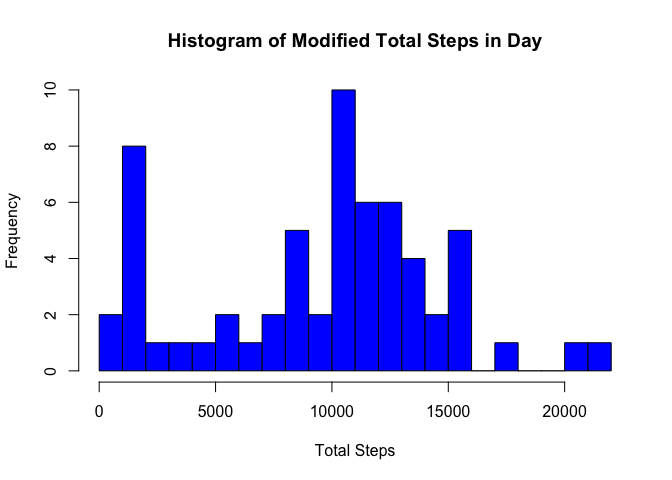

# Reproducible Research: Peer Assessment 1
 
 
## Loading and preprocessing the data
 

```r
urlfile <- "http://d396qusza40orc.cloudfront.net/repdata%2Fdata%2Factivity.zip"
download.file(urlfile,destfile="temp.zip")
unzip("temp.zip", "activity.csv")
raw <- read.csv("activity.csv")
```


## What is mean total number of steps taken per day?


We are ignoring missing values for this part of the assignment.


```r
clean <- raw[complete.cases(raw),]
```
 

### Histogram


```r
steps_by_date <- aggregate(steps ~ date, data = clean, sum)
```

Let us plot the histogram of total steps in a day.


```r
hist(steps_by_date$steps, breaks = 25, xlab= "Total Steps",
     col="green",main="Histogram of Total Steps in Day excluding NA")
```

 

### Mean & Median
Now let us compute the mean and median of the steps taken each day.

```r
mean(steps_by_date$steps);median(steps_by_date$steps)
```

```
## [1] 10766.19
```

```
## [1] 10765
```
## What is the average daily activity pattern?


```r
avg_steps_by_int <- aggregate(steps ~ interval, data = clean, mean)
```

### Time Series Plot


```r
plot(avg_steps_by_int, type="l",
     main="Mean Steps by Interval",
     ylab="Average Steps", xlab = "Interval")
```

 

### Which 5-minute interval, on average across all the days in the dataset, contains the maximum number of steps?


```r
avg_steps_by_int[avg_steps_by_int[,2]== max(avg_steps_by_int$steps),]
```

```
##     interval    steps
## 104      835 206.1698
```

Thus, interval 835 contains the maximum number of average steps.


## Imputing missing values

### Calculate and report the total number of missing values in the dataset

```r
sum(is.na(raw$steps))
```

```
## [1] 2304
```


### Devise a strategy for filling in all of the missing values in the dataset

I believe a solid approach is to replace all missing values with the median of their respective interval. Since medians are not sensitive to extreme values, I use the median instead of the mean. Some may argue for using the mean, but if we inspect the data, we see that there are several extreme values for steps. I use intervals as opposed to dates, because each interval is missing 8 of 61 values, though the missing values are not spread out evenly for dates. Most dates have missing no values, while eight dates are missing 288 values.

### Create a new dataset that is equal to the original dataset but with the missing data filled in

```r
med_steps_by_int <- aggregate(steps ~ interval, data = clean, median)
mod <- raw
for (i in 1:nrow(mod)) {
    if(is.na(mod[i,1])) {mod[i,1] <- med_steps_by_int[med_steps_by_int$interval == mod[i,3],2]}
}
```

### What is the impact of imputing missing data

First let us plot a barplot of the modified dataset.


```r
mod_steps_by_date <- aggregate(steps ~ date, data = mod, sum)
hist(mod_steps_by_date$steps, breaks = 25, xlab= "Total Steps",
     col="blue", main="Histogram of Modified Total Steps in Day")
```

 

Now let us compute the mean and median of the steps taken each day.

```r
mean(mod_steps_by_date$steps);median(mod_steps_by_date$steps)
```

```
## [1] 9503.869
```

```
## [1] 10395
```


We see that both the mean and median are slightly reduced, and there are more days with fewer steps. Generally, the histogram keeps it shape. In fact, we have near perfect overlap except for the second lowest break. This is because we had several days with missing values that were not being represented in the first histogram.


## Are there differences in activity patterns between weekdays and weekends?


### Create a new factor variable in the dataset with two levels – “weekday” and “weekend”

**lubridate** will make this section a bit easier.


```r
library(lubridate)
mod$type <- as.factor(wday(ymd(mod$date)) %in% c(1,7))
levels(mod$type) <- c("weekday","weekend")
```


### Time Series Plots

```r
avg_steps_by_int_wd <- aggregate(steps ~ interval, data = mod[mod$type %in% "weekday",], mean)
avg_steps_by_int_we <- aggregate(steps ~ interval, data = mod[mod$type %in% "weekend",], mean)

layout(matrix(1:2, ncol = 1), widths = 1, heights = c(3,3), respect = FALSE)
par(mar = c(0, 4.1, 4.1, 2.1),las=1)
plot(avg_steps_by_int_wd, type = 'l', ylab="Weekdays", 
     xaxt = 'n', main = 'Modified Mean Steps by Interval',ylim=c(0,220))
par(mar = c(4.1, 4.1, 0, 2.1))
plot(avg_steps_by_int_we, type = 'l',ylab="Weekends",
     xlab="Interval",ylim=c(0,220))
```

 


